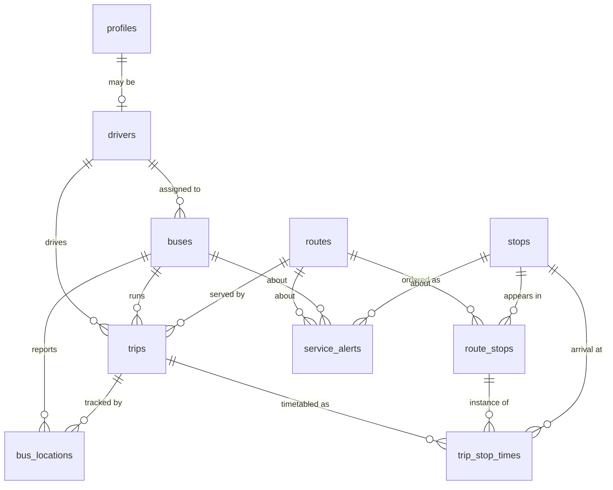

# Data model - Smart Public Transport & Bus Tracking (Karachi)

> **Demo data.** Every route, timetable, fare, bus and driver in the seed is invented for this
> hackathon. Stop coordinates are approximate positions of real Karachi landmarks so the map looks
> plausible. Nothing here describes a real Karachi bus service. See [ASSUMPTIONS.md](./ASSUMPTIONS.md).

## Entity relationship diagram



## Tables

| Table | Purpose | Primary key | Key foreign keys |
| --- | --- | --- | --- |
| `profiles` | App users (passenger, driver, operator, admin) | `id` uuid | `auth_user_id` -> `auth.users(id)`, nullable and unenforced |
| `drivers` | Driver records | `id` uuid | `profile_id` -> `profiles` |
| `buses` | Fleet vehicles and their live status | `id` uuid | `assigned_driver_id` -> `drivers` |
| `routes` | Corridors with planning speed, fare, headway | `id` uuid | - |
| `stops` | Physical stop locations with lat/lon | `id` uuid | - |
| `route_stops` | Ordered stop sequence per route and direction | `id` uuid | `route_id` -> `routes`, `stop_id` -> `stops` |
| `trips` | One bus running one route at a point in time | `id` uuid | `route_id`, `bus_id`, `driver_id`, `next_stop_id` |
| `bus_locations` | Append-only GPS history | `id` bigint identity | `bus_id` -> `buses`, `trip_id` -> `trips` (nullable) |
| `trip_stop_times` | Scheduled / estimated / actual arrival per stop | `id` uuid | `trip_id`, `route_stop_id`, `stop_id` |
| `service_alerts` | Operator notices | `id` uuid | `route_id`, `bus_id`, `stop_id` (all optional) |

### Natural keys

Every table that the seed references has a human-readable unique key, so SQL and fixtures never
have to hard-code UUIDs: `stops.code`, `routes.code`, `buses.registration_no`,
`drivers.license_no`, `trips.trip_code`, `profiles.email`.

### Important constraints

- `route_stops` is unique on `(route_id, direction, stop_order)` **and** `(route_id, direction, stop_id)`,
  so a route cannot have two stops in the same position or visit the same stop twice per direction.
- `trips.scheduled_end_at > scheduled_start_at`.
- `trip_stop_times` is unique on `(trip_id, route_stop_id)`.
- Latitude/longitude, capacity, fare, speed and distance all carry range checks.
- `routes.color` must be a `#RRGGBB` hex string, so the map can use it directly.

## Enums

| Enum | Values |
| --- | --- |
| `user_role` | `passenger`, `driver`, `operator`, `admin` |
| `driver_status` | `active`, `off_duty`, `on_leave` |
| `bus_status` | `active`, `idle`, `maintenance`, `offline` |
| `trip_status` | `scheduled`, `in_progress`, `completed`, `cancelled` |
| `trip_direction` | `outbound`, `inbound` |
| `stop_arrival_status` | `pending`, `arrived`, `skipped` |
| `alert_severity` | `info`, `warning`, `critical` |

Delay is **not** a status. It is `trips.delay_minutes` (positive = late, negative = early), so a
trip can be in progress and late at the same time. The UI threshold used by the views is
`delay_minutes >= 5`.

## How position and progress work

`trips.progress_km` is the distance covered from the route origin. It is the single source of truth
for where a bus is along its route; `last_stop_order` and `next_stop_id` are derived from it, and
the seed derives them with SQL rather than hard-coding them so the three values cannot disagree.

`fn_route_point_at_km(route_id, direction, km)` linearly interpolates a lat/lon/bearing at any
distance along a route. The seed uses it to generate GPS trails that sit exactly on the route
polyline, and the GPS simulator can use the same function later.

## Deterministic ETA

No model, no inference - plain arithmetic, implemented in `v_trip_stop_eta`:

```
remaining_km = max(stop.distance_from_start_km - trip.progress_km, 0)
speed_kmh    = latest non-zero reported speed, else routes.avg_speed_kmh
travel_min   = remaining_km / speed_kmh * 60
dwell_min    = 0.5 * (intermediate stops still to serve)
eta_minutes  = ceil(travel_min + dwell_min)

estimated_arrival_at    = now() + eta_minutes
scheduled_arrival_at    = trip.scheduled_start_at + route_stops.scheduled_offset_min
projected_delay_minutes = estimated_arrival_at - scheduled_arrival_at
```

The zero-speed fallback matters: a bus stationary in traffic reports `speed_kmh = 0`, and without
the fallback the ETA would be infinite. The seed deliberately includes one such bus
(`TRP-D2-0001`) so the behaviour is visible in the demo.

## Functions

| Function | Returns | Use |
| --- | --- | --- |
| `fn_search_routes(origin_stop, destination_stop)` | route options | Passenger journey search (direct routes only) |
| `fn_stop_arrivals(stop_id, limit)` | next buses at a stop | "When is my bus?" board |
| `fn_trip_eta_minutes(trip_id, stop_id)` | integer | Single ETA lookup |
| `fn_nearby_stops(lat, lon, radius_km, limit)` | stops with distance | "Stops near me" |
| `fn_haversine_km(lat1, lon1, lat2, lon2)` | numeric km | Straight-line distance, no PostGIS needed |
| `fn_route_point_at_km(route_id, direction, km)` | lat/lon/heading | Interpolate a position along a route |

## Views

| View | Use |
| --- | --- |
| `v_active_trips` | Live map: running trips with route, bus, driver, next stop, latest fix, progress % |
| `v_trip_stop_eta` | Every upcoming stop of every live trip with its ETA |
| `v_fleet_status` | Operator table: one row per bus, with a `telemetry_stale` flag |
| `v_fleet_overview` | Single-row KPI strip (fleet counts, delays, alerts) |
| `v_route_summary` | Route catalogue with stop counts, endpoints and live trip counts |
| `v_bus_latest_location` | Newest GPS fix per bus |

All views are `security_invoker`, so row level security still applies through them.

## Query recipes for the frontend

```ts
// Live map
const { data } = await supabase.from('v_active_trips').select('*');

// Fleet table + KPI strip
const { data: fleet } = await supabase.from('v_fleet_status').select('*');
const { data: kpis } = await supabase.from('v_fleet_overview').select('*').single();

// Arrivals board for one stop
const { data: arrivals } = await supabase.rpc('fn_stop_arrivals', {
  p_stop_id: stopId,
  p_limit: 5,
});

// Journey search
const { data: options } = await supabase.rpc('fn_search_routes', {
  p_origin_stop_id: fromId,
  p_destination_stop_id: toId,
});

// Stops near the user
const { data: near } = await supabase.rpc('fn_nearby_stops', {
  p_latitude: 24.8607,
  p_longitude: 67.0099,
  p_radius_km: 2,
  p_limit: 10,
});

// Full stop sequence for drawing a route polyline
const { data: shape } = await supabase
  .from('route_stops')
  .select('stop_order, distance_from_start_km, scheduled_offset_min, stops(name, latitude, longitude)')
  .eq('route_id', routeId)
  .eq('direction', 'outbound')
  .order('stop_order');
```

## Seed data at a glance

| Table | Rows |
| --- | --- |
| `profiles` | 10 (1 admin, 2 operators, 3 drivers, 4 passengers) |
| `drivers` | 8 |
| `buses` | 10 (4 active, 3 idle, 1 maintenance, 2 offline) |
| `stops` | 31 |
| `routes` | 5 |
| `route_stops` | 66 (46 outbound, 20 inbound for D1 and D2) |
| `trips` | 8 (4 in progress, 2 scheduled, 1 completed, 1 cancelled) |
| `trip_stop_times` | 66 |
| `bus_locations` | 38 (32 live trail points + 6 last-known fixes) |
| `service_alerts` | 5 (4 active, 1 expired) |

### Demo corridors

| Code | Name | Stops | Distance | Duration | Fare |
| --- | --- | --- | --- | --- | --- |
| `KHI-D1` | D1 Tower - Power House | 10 (both directions) | 16.0 km | 60 min | PKR 60 |
| `KHI-D2` | D2 Keamari - Gulshan-e-Iqbal | 10 (both directions) | 18.0 km | 62 min | PKR 70 |
| `KHI-D3` | D3 Surjani Town - Saddar | 9 (outbound only) | 18.8 km | 65 min | PKR 70 |
| `KHI-D4` | D4 Model Colony - Clifton | 10 (outbound only) | 22.5 km | 72 min | PKR 80 |
| `KHI-D5` | D5 Korangi Crossing - Tower | 7 (outbound only) | 15.5 km | 51 min | PKR 55 |

Routes share stops on purpose (Saddar, Tower, Nursery, Karsaz, Millennium Mall, Boat Basin, Teen
Talwar, Power House, Board Office, Nazimabad No. 1), which is what makes journey search return more
than one option.

### Scenarios the seed guarantees

Trip times are generated relative to `now()`, so re-running the seed refreshes the live state.

| Scenario | Where to see it |
| --- | --- |
| Healthy live trip | `TRP-D1-0001`, bus `DEMO-KHI-101`, 2 min late |
| Badly delayed bus, stationary in traffic | `TRP-D2-0001`, bus `DEMO-KHI-102`, 14 min late, latest speed 0 |
| Bus running ahead of schedule | `TRP-D3-0001`, bus `DEMO-KHI-103`, 3 min early |
| Mildly delayed trip | `TRP-D4-0001`, bus `DEMO-KHI-108`, 6 min late |
| Upcoming departures | `TRP-D1-0002` (+25 min), `TRP-D5-0001` (+40 min) |
| Completed trip for analytics | `TRP-D2-0002`, finished 8 min late |
| Cancelled trip | `TRP-D1-0003`, bus withdrawn for maintenance |
| Offline buses with stale telemetry | `DEMO-KHI-107` (3 days), `DEMO-KHI-110` (1 day) |
| Bus in maintenance | `DEMO-KHI-106` |
| Active alerts of each severity | `service_alerts` (info, warning, critical) |
