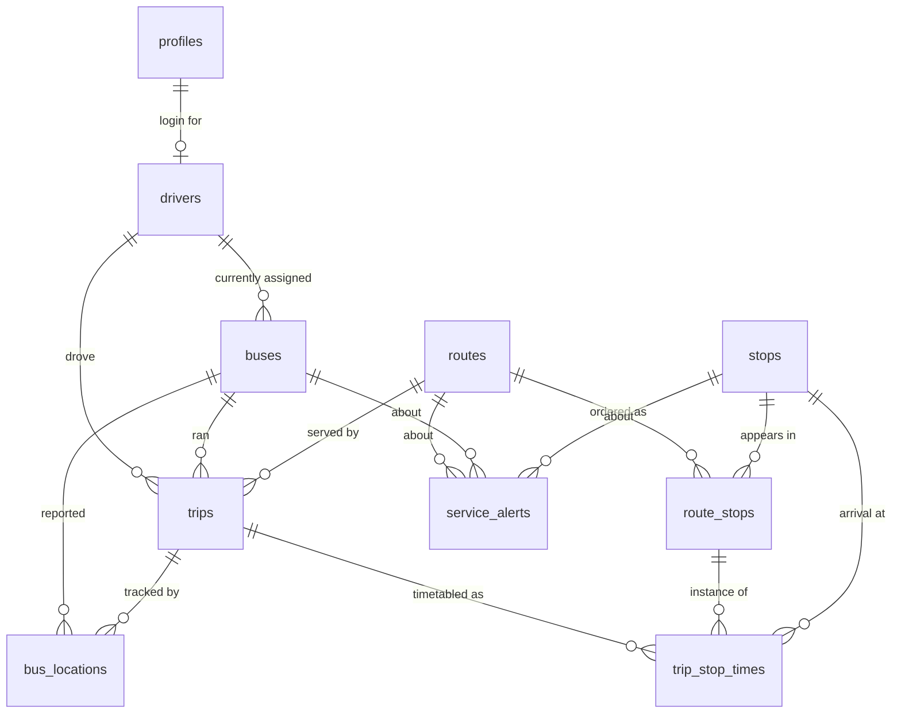

# Domain model and relationships

> **DEMO / SIMULATED HACKATHON DATA.** See [ASSUMPTIONS.md](./ASSUMPTIONS.md).

Column-level detail lives in [database-plan.md](./database-plan.md). This document is about how the
entities relate and how a request flows through them.

## Entity relationships



## The relationships that matter

### Profile <-> Driver (one to zero-or-one)

`drivers.profile_id` is a unique, nullable FK. A driver may exist with no login (operator created
the record), and a profile with `role = 'driver'` may exist before the driver record is made.

They are separate tables because a login and an employment record have different lifecycles: an
operator must be able to manage a driver who has never opened the app, and deleting a login must
not delete trip history. `on delete set null` enforces that.

### Bus <-> Driver (two different relationships - do not confuse them)

| Relationship | Where | Meaning |
| --- | --- | --- |
| Current assignment | `buses.assigned_driver_id` | Who is rostered on this vehicle *right now*. Mutable, no history |
| Historical fact | `trips.driver_id` | Who actually drove this trip. Immutable record |

This split is why there is no `bus_drivers` join table. Current assignment is a single mutable
pointer; history is already captured per trip. Reassigning a bus does not rewrite the past.

`buses.assigned_driver_id` is nullable (`on delete set null`) because a bus in maintenance has no
driver.

### Bus <-> Route (no direct relationship, on purpose)

**There is no `buses.route_id`.** A bus is not permanently tied to a route; it is tied to a route
*for the duration of a trip*. The relationship is therefore `buses -> trips -> routes`.

"Which buses are running on route X" is:

```sql
select b.* from public.buses b
join public.trips t on t.bus_id = b.id and t.status = 'in_progress'
where t.route_id = $1;
```

Adding a direct bus-to-route column would immediately contradict `trips` the first time a bus was
reassigned mid-day.

### Route <-> Stop (many to many, through route_stops)

A stop serves many routes and a route has many stops, so the join table is unavoidable. What makes
`route_stops` more than a plain join table is that it carries the three things that make the stop
*positioned*:

- `stop_order` - the sequence
- `distance_from_start_km` - where it is along the route, used for ETA and interpolation
- `scheduled_offset_min` - when it is due, relative to trip start

Shared stops are what make journey search useful. In the demo dataset, Saddar appears on four
routes, and Nursery, Karsaz, Millennium Mall, Boat Basin, Teen Talwar, Tower, Power House, Board
Office and Nazimabad No. 1 each appear on more than one.

### Route <-> route_stop ordering

Direction is part of the key, not a separate route. `unique (route_id, direction, stop_order)` plus
`unique (route_id, direction, stop_id)` means:

- Within one route and direction, positions are unique and stops are not repeated.
- The same stop can legitimately appear in both the outbound and inbound sequence, at mirrored
  positions.

For `KHI-D1` and `KHI-D2` the inbound sequence is generated by reversing the outbound one and
mirroring distances (`route.distance_km - distance_from_start_km`) and offsets
(`route.expected_duration_min - scheduled_offset_min`). That assumes the return journey takes the
same path in the same time - an explicit simplification.

Two invariants the validator enforces, because everything downstream trusts them:

1. `stop_order` is a gapless `1..n` sequence per route and direction.
2. `distance_from_start_km` and `scheduled_offset_min` strictly increase along that sequence.

### Trip <-> Bus, Driver, Route

`trips` is the join of all three, plus time. `bus_id` is required (`on delete restrict` - you
cannot delete a bus that has history). `driver_id` is optional (`on delete set null`), so a trip
survives a driver record being removed and the golden path works before drivers are wired up.
`route_id` is required.

A bus running the same route twice in a day produces two trip rows. This is why `trips`, not
`buses`, is the unit of live tracking.

### Trip <-> Location history

`bus_locations.bus_id` is required; `bus_locations.trip_id` is nullable. Both FKs exist on purpose:

- `bus_id` required - every fix came from some vehicle, and a parked bus still reports a position.
- `trip_id` nullable - a fix recorded between trips belongs to no trip.

`on delete set null` on `trip_id` means deleting a trip does not destroy the raw telemetry.

### Service alert <-> Route / Bus / Stop

All three scope columns are nullable, which gives a scoping lattice from one table: network-wide
(all null), route-wide, route-plus-stop, or vehicle-specific.

There is deliberately **no** `trip_id`. A passenger cares that "D2 is delayed near Karsaz", not
that trip `TRP-D2-0001` specifically is delayed; and an alert about a vehicle fault outlives the
trip it was raised on. Scoping by route and bus covers every case in the brief with fewer columns.

## Avoided duplication

| Tempting | Why it is not there |
| --- | --- |
| `buses.current_latitude/longitude` | Would duplicate the newest `bus_locations` row and could disagree with it. `v_bus_latest_location` derives it instead |
| `buses.route_id` | Contradicts `trips` as soon as a bus is reassigned |
| `trips.current_stop_id` *and* `next_stop_id` *and* `progress_km` as independent columns | `progress_km` is authoritative; the other two are derived from it in SQL |
| `routes.stop_count` | A `count(*)` away; `v_route_summary` computes it |
| `bus_drivers` join table | Current assignment is a pointer, history is in `trips` |
| `trip_stop_times` for cancelled trips | Not inserted at all - a cancelled trip has no timetable to meet |

## The golden path

Each step below is a real query or write against the schema.

**1. Passenger searches origin -> destination**

```sql
select * from public.fn_search_routes($origin_stop_id, $destination_stop_id);
```

Self-joins `route_stops` on `route_id` and `direction` where the destination's `stop_order` is
greater than the origin's, filters out suspended routes, and orders by scheduled journey time.
Direct routes only.

**2. Route found**

The result carries `route_code`, `distance_km`, `estimated_duration_min`, `fare_pkr` and
`active_trip_count`. Drawing the route is `route_stops` joined to `stops`, ordered by `stop_order`.

**3. Suitable bus found**

```sql
select * from public.fn_stop_arrivals($origin_stop_id, 5);
```

Returns the live trips approaching that stop, soonest first, each with `eta_minutes` and
`gps_status`.

**4. Passenger tracks the bus**

`v_active_trips` filtered to the chosen `trip_id` gives position, heading, speed, progress
percentage, next stop and `gps_status`.

**5. Driver starts a trip**

```sql
update public.trips set status = 'in_progress', actual_start_at = now() where id = $1;
update public.buses set status = 'active' where id = $2;
```

The trip appears in `v_active_trips` the moment its status changes. `TRP-D1-0002` is seeded as
`scheduled` to be the target of this step.

**6. Driver GPS updates**

```sql
insert into public.bus_locations
  (bus_id, trip_id, latitude, longitude, speed_kmh, heading_deg, progress_km, source)
values ($1, $2, $3, $4, $5, $6, $7, 'device');
```

Then `trips.progress_km` is advanced and `last_stop_order` / `next_stop_id` re-derived from it.

**7. Realtime location change -> 8. passenger sees movement**

A realtime subscription on `bus_locations` inserts signals the change; the client re-reads
`v_active_trips`. The newest fix wins because `v_bus_latest_location` is a
`distinct on (bus_id) ... order by recorded_at desc`.

**9. ETA updates**

`v_trip_stop_eta` recomputes on every read from the new `progress_km` and reported speed. Nothing
is cached, so there is no staleness to manage.

**10. Operator monitors the trip**

`v_fleet_status` (one row per bus, with `is_delayed` and `telemetry_stale`) and
`v_fleet_overview` (the KPI strip).

**11. Trip completes**

```sql
update public.trips
set status = 'completed', actual_end_at = now(), progress_km = $route_distance, next_stop_id = null
where id = $1;
update public.buses set status = 'idle' where id = $2;
```

It leaves `v_active_trips` automatically, because that view filters on `status = 'in_progress'`.

**12. Trip data remains available for analytics**

The `trips` row keeps `scheduled_start_at`, `actual_start_at`, `actual_end_at`, `delay_minutes`,
`route_id`, `bus_id` and `driver_id`. The `bus_locations` trail is retained. Nothing is deleted on
completion, so every analytics figure in [demo-scenarios.md](./demo-scenarios.md) is derivable.
