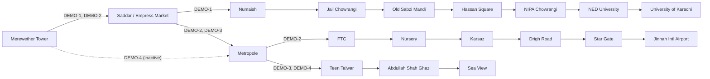

# Karachi demo dataset

> **DEMO / SIMULATED HACKATHON DATA.** Every route, route number, timetable, bus, registration,
> driver, trip, delay, alert and history row in `data/standalone/karachi-demo-data.json` is invented for this
> hackathon. **None of it is official Karachi public transport data**, and none of it describes a
> real operator, BRT line or bus service. Stop coordinates are approximate positions of well-known
> public landmarks; a landmark being real does not mean a bus stop exists there. Driver names are
> fictional. Show a "Demo data" label in the UI.

| | |
| --- | --- |
| Data file | [`data/standalone/karachi-demo-data.json`](../../data/standalone/karachi-demo-data.json) |
| Validator | `node scripts/validate-standalone-data.mjs` (Node 18+, no dependencies) |
| Companion docs | [gps-scenarios.md](./gps-scenarios.md) · [demo-scenarios.md](./demo-scenarios.md) · [eta-data-spec.md](./eta-data-spec.md) |

## 1. Status and scope

- **Standalone.** The file does not depend on, or change, anything under `supabase/`. Member 1's
  schema, seed and generated files on `main` are untouched.
- **Separate from the seed-derived dataset.** `main` also has `data/karachi-demo-data.json`, which
  `scripts/export-demo-data.mjs` generates from `supabase/seed.sql` and `scripts/validate-db.mjs`
  checks against the database. Its docs are `docs/demo-scenarios.md`, `docs/gps-data-design.md`
  and `docs/eta-data-design.md`, plus `data/gps-scenarios.json`. The two datasets use different
  IDs, routes and stops (`STOP-01` / `ROUTE-01` here, `ST-SDR` / `KHI-D1` there), so do not mix
  them in one load. Pick one for the demo, or port pieces such as the cross-checked coordinates
  in §12. That decision is Member 1's; Section 10 shows one possible mapping onto the schema on
  `main`.
- **Schema-agnostic layout.** Flat arrays of rows keyed by readable string IDs, snake_case
  fields and no nesting beyond small value objects. Any importer, whether SQL, Supabase JS or a
  script, can walk it top to bottom.

## 2. At a glance

| Section | Rows | What it holds |
| --- | --- | --- |
| `meta` | – | Disclaimer, units, time convention, status vocabularies, thresholds, field definitions, row counts |
| `stops` | 19 | Landmark-based stops with coordinates, search aliases and typical dwell |
| `routes` | 4 | 3 active + 1 inactive. Ordered `stop_ids`, distance, scheduled duration |
| `route_stops` | 56 | Route-stop relationships for **both** directions, with distance and timetable offset per stop |
| `drivers` | 6 | 4 on duty, 1 off duty, 1 on leave |
| `buses` | 7 | 3 active, 2 idle, 1 offline, 1 maintenance |
| `trips` | 4 | 3 in progress (one already delayed), 1 scheduled. Live snapshot at T0 |
| `bus_positions_at_t0` | 6 | Latest GPS fix per bus. `BUS-06` deliberately has none |
| `service_alerts` | 6 | 3 active, 1 scheduled, 1 expired, 1 draft |
| `eta_inputs.route_segments` | 48 | Per stop-pair distance, timetable run time and simulated historical run times |
| `gps_scenarios` | 5 | Scenarios A–E with motion phases, snapshot and checkpoints. See [gps-scenarios.md](./gps-scenarios.md) |
| `demo_stories` | 5 | Judging demos 1–5 with triggers and expected outcomes. See [demo-scenarios.md](./demo-scenarios.md) |
| `trip_history` | 6 | Earlier trips today (5 completed, 1 cancelled) for analytics |

## 3. Conventions

### IDs

Stable, human-readable string keys: `STOP-01`, `ROUTE-01`, `BUS-01`, `DRV-01`, `TRIP-01`, `ALERT-01`,
`GPS-A`, `DEMO-1`, `HIST-01`. They are natural keys, not database keys: generate UUIDs (or serials)
at import and keep the string ID in a `code`-style column so references stay readable.

Display names deliberately carry a demo marker. Routes show as `DEMO-1` … `DEMO-4`, never as a real
Karachi route number. Bus numbers are `201`–`207`, registrations `DEMO-KHI-2xx`, licences
`DEMO-LIC-20xx`.

### Time: everything is relative to T0

A static file cannot hold "live" timestamps, so all times are **offsets from T0**, the moment the
data is loaded / the simulator starts:

- `*_offset_min`: minutes relative to T0 (negative = before T0). Example: `scheduled_start_offset_min: -9`.
- `*_s` / `t_s`: seconds after T0, used by GPS scenarios and demo triggers.
- Convert with `absolute_time = T0 + offset`. Karachi is UTC+05:00 with no daylight saving.
- `meta.example_t0` is `2026-10-01T11:00:00+05:00`. Clock times quoted in the docs assume it, but
  nothing in the data depends on it. Reload with a fresh T0 before each demo.

### Units and coordinates

Distances in km, speeds in km/h, durations in minutes unless the field ends in `_s`. Coordinates
are WGS84 decimal degrees (`latitude`, `longitude`). Stops use 4 decimals (about 11 m, approximate
on purpose). Simulated positions use 5.

### Status vocabularies

All allowed values are listed in `meta.vocabularies`; the validator rejects anything else.

| Field | Values |
| --- | --- |
| `routes[].status` | `active`, `inactive` |
| `buses[].status` | `active` (on a trip), `idle`, `maintenance`, `offline` |
| `drivers[].status` | `active` (on duty), `off_duty`, `on_leave` |
| `trips[].status` | `scheduled`, `in_progress`, `completed`, `cancelled` |
| `direction` | `outbound` (order of `routes[].stop_ids`), `inbound` (reverse) |
| `gps_source` | `simulated` (simulator), `device` (driver's phone) |
| `service_alerts[].status` / `severity` / `audience` | `draft`/`scheduled`/`active`/`expired` · `info`/`warning`/`critical` · `all`/`operators` |
| Derived states (not stored) | tracking `live`/`stale`/`unavailable` · motion `moving`/`approaching`/`at_stop`/`stopped` · punctuality `early`/`on_time`/`delayed` |

**Delay is a number, not a status.** `delay_min` is signed (positive = late). "Delayed" is derived
from it using `meta.thresholds` (≥ 5 min). The thresholds, and the exact delay formula, are in
[gps-scenarios.md §3](./gps-scenarios.md#3-derived-states-and-thresholds).

## 4. Network



Saddar is the hub. Every active route serves it, which makes stop boards and journey search
interesting. Interchanges: Tower (DEMO-1/2), Saddar (DEMO-1/2/3), Metropole (DEMO-2/3).

| ID | Badge | Name | Stops | Distance | Scheduled | Avg speed | Status |
| --- | --- | --- | --- | --- | --- | --- | --- |
| `ROUTE-01` | DEMO-1 | Tower – University of Karachi | 9 | 18.1 km | 65 min | 16.7 km/h | active |
| `ROUTE-02` | DEMO-2 | Tower – Jinnah International Airport | 9 | 23.5 km | 69 min | 20.4 km/h | active |
| `ROUTE-03` | DEMO-3 | Saddar – Sea View | 5 | 8.8 km | 31 min | 17.0 km/h | active |
| `ROUTE-04` | DEMO-4 | Tower – Sea View (weekend service) | 5 | 11.2 km | 37 min | 18.2 km/h | **inactive** |

`ROUTE-04` exists to exercise the active/inactive status. It reuses existing stops, has no buses
or trips, journey search should not return it, and `ALERT-02` explains the suspension to
passengers.

### Outbound timetables

Distance from the first stop / scheduled minutes after departure. Inbound is the mirror (§12).

| Route | Stops (km / min) |
| --- | --- |
| `ROUTE-01` | Tower 0/0 → Saddar 4.3/17 → Numaish 6.1/25 → Jail Chowrangi 8.9/35 → Old Sabzi Mandi 10.4/40 → Hassan Square 12.0/46 → NIPA 15.2/55 → NED University 17.7/63 → University of Karachi 18.1/65 |
| `ROUTE-02` | Tower 0/0 → Saddar 4.3/17 → Metropole 5.8/25 → FTC 8.4/32 → Nursery 9.6/35 → Karsaz 13.7/45 → Drigh Road 17.3/53 → Star Gate 20.6/60 → Airport 23.5/69 |
| `ROUTE-03` | Saddar 0/0 → Metropole 1.5/6 → Teen Talwar 3.9/15 → Abdullah Shah Ghazi 7.0/24 → Sea View 8.8/31 |
| `ROUTE-04` | Tower 0/0 → Metropole 3.9/13 → Teen Talwar 6.3/21 → Abdullah Shah Ghazi 9.4/31 → Sea View 11.2/37 |

## 5. Stops

| ID | Name | Area | Latitude | Longitude | Confidence |
| --- | --- | --- | --- | --- | --- |
| `STOP-01` | Merewether Tower | Kharadar (old city) | 24.8489 | 66.9974 | high |
| `STOP-02` | Saddar (Empress Market) | Saddar | 24.8612 | 67.0302 | medium |
| `STOP-03` | Numaish Chowrangi | M.A. Jinnah Road | 24.8731 | 67.0361 | medium |
| `STOP-04` | Jail Chowrangi | University Road | 24.8848 | 67.0566 | high |
| `STOP-05` | Old Sabzi Mandi | University Road | 24.8948 | 67.0632 | medium |
| `STOP-06` | Hassan Square | Gulshan-e-Iqbal | 24.9022 | 67.0739 | medium |
| `STOP-07` | NIPA Chowrangi | Gulshan-e-Iqbal | 24.9178 | 67.0971 | high |
| `STOP-08` | NED University | University Road | 24.9300 | 67.1156 | medium |
| `STOP-09` | University of Karachi (Silver Jubilee Gate) | University Road | 24.9311 | 67.1183 | medium |
| `STOP-10` | Metropole | Club Road / Shahrah-e-Faisal | 24.8504 | 67.0307 | high |
| `STOP-11` | FTC (Shahrah-e-Faisal) | Shahrah-e-Faisal | 24.8584 | 67.0522 | high |
| `STOP-12` | Nursery | PECHS / Shahrah-e-Faisal | 24.8606 | 67.0629 | medium |
| `STOP-13` | Karsaz | Shahrah-e-Faisal | 24.8770 | 67.0951 | medium |
| `STOP-14` | Drigh Road | Shahrah-e-Faisal | 24.8863 | 67.1261 | high |
| `STOP-15` | Star Gate | Shahrah-e-Faisal | 24.8873 | 67.1558 | medium |
| `STOP-16` | Jinnah International Airport | Airport | 24.9065 | 67.1608 | **low** |
| `STOP-17` | Teen Talwar | Clifton | 24.8339 | 67.0337 | high |
| `STOP-18` | Abdullah Shah Ghazi Shrine | Clifton | 24.8110 | 67.0306 | medium |
| `STOP-19` | Sea View (Clifton Beach) | Clifton | 24.7985 | 67.0350 | medium |

Each stop also has:

- `aliases` for text search. `"City Centre"` resolves only to Saddar. `"University"` is
  deliberately ambiguous and matches both NED University and University of Karachi, so the search
  UI should let the passenger pick.
- `typical_dwell_s`: 60 s at interchanges and termini, 30 s elsewhere.

Where each coordinate came from is in §12.

## 6. Fleet

| Bus | No. | Registration | Route | Driver | Status | Capacity | Type | AC |
| --- | --- | --- | --- | --- | --- | --- | --- | --- |
| `BUS-01` | 201 | DEMO-KHI-201 | `ROUTE-01` | `DRV-01` | active | 70 | standard_12m | no |
| `BUS-02` | 202 | DEMO-KHI-202 | `ROUTE-02` | `DRV-02` | active | 70 | standard_12m | yes |
| `BUS-03` | 203 | DEMO-KHI-203 | `ROUTE-03` | `DRV-03` | active | 45 | midi_9m | no |
| `BUS-04` | 204 | DEMO-KHI-204 | `ROUTE-01` | `DRV-04` | idle | 70 | standard_12m | yes |
| `BUS-05` | 205 | DEMO-KHI-205 | `ROUTE-03` | – | **offline** | 45 | midi_9m | no |
| `BUS-06` | 206 | DEMO-KHI-206 | `ROUTE-02` | – | **maintenance** | 70 | standard_12m | yes |
| `BUS-07` | 207 | DEMO-KHI-207 | `ROUTE-02` | `DRV-05` | idle | 45 | midi_9m | yes |

| Driver | Name (fictional) | Licence | Status |
| --- | --- | --- | --- |
| `DRV-01` | Asad Mehmood | DEMO-LIC-2001 | active |
| `DRV-02` | Kamran Siddiqui | DEMO-LIC-2002 | active |
| `DRV-03` | Ghulam Haider Memon | DEMO-LIC-2003 | active |
| `DRV-04` | Shahzad Baloch | DEMO-LIC-2004 | active |
| `DRV-05` | Sadia Parveen | DEMO-LIC-2005 | off_duty |
| `DRV-06` | Naveed Qureshi | DEMO-LIC-2006 | on_leave |

No phone numbers or e-mail addresses are included, so nothing can reach a real person.

The inactive and offline examples:

- `BUS-05` is offline. Its last fix was T0−170 min at Sea View, and it is the subject of
  operator alert `ALERT-03`.
- `BUS-06` is in maintenance and has **no position at all**, to test "no location data" handling.
- `BUS-04` and `BUS-07` are idle with old fixes. Old fixes are normal for idle buses and must not
  raise GPS alarms.

## 7. Trips at T0

| Trip | Route / direction | Bus / driver | Status | Sched. start | Actual start | Progress | Between | Speed | Delay | State |
| --- | --- | --- | --- | --- | --- | --- | --- | --- | --- | --- |
| `TRIP-01` | `ROUTE-01` outbound | `BUS-01` / `DRV-01` | in_progress | T0−9 | T0−8 | 1.771 km (9.8%) | Tower → Saddar | 15.2 | +2.0 | moving, on time |
| `TRIP-02` | `ROUTE-02` outbound | `BUS-02` / `DRV-02` | in_progress | T0−52 | T0−50 | 11.700 km (49.8%) | Nursery → Karsaz | 15.0 | **+11.9** | moving, **delayed** |
| `TRIP-03` | `ROUTE-03` inbound | `BUS-03` / `DRV-03` | in_progress | T0−16 | T0−16 | 4.620 km (52.5%) | Abdullah Shah Ghazi → Teen Talwar | 18.0 | +0.8 | approaching, on time |
| `TRIP-04` | `ROUTE-01` outbound | `BUS-04` / `DRV-04` | scheduled | T0+5 | – | – | waiting at Tower | – | – | scheduled |

`trips[].live` holds the full T0 snapshot: position, the stops either side, distance to the next
stop, elapsed time (from the scheduled and from the actual start), timetable position, delay,
speed, heading and derived states. `TRIP-04` has `live: null` until the driver starts it in
Demo 3. `bus_positions_at_t0` repeats each live position as a GPS-fix row, ready for a location
table.

## 8. Service alerts

| ID | Status at T0 | Severity | Audience | Title | Scope | Window (min) |
| --- | --- | --- | --- | --- | --- | --- |
| `ALERT-01` | active | warning | all | Slow traffic on Shahrah-e-Faisal near Karsaz | `ROUTE-02`, `STOP-13` | −35 → open |
| `ALERT-02` | active | info | all | DEMO-4 Tower - Sea View is not running today | `ROUTE-04` | −660 → open |
| `ALERT-03` | active | critical | operators | Bus 205 is not reporting its location | `BUS-05` | −160 → open |
| `ALERT-04` | scheduled | warning | all | Planned overnight road works at Jail Chowrangi | `ROUTE-01`, `STOP-04` | +660 → +1080 |
| `ALERT-05` | expired | info | all | Resolved: Teen Talwar diversion lifted | `ROUTE-03`, `STOP-17` | −300 → −60 |
| `ALERT-06` | draft | warning | all | Congestion on M.A. Jinnah Road | `ROUTE-01`, `STOP-02` | set when published |

`ALERT-06` is a ready-made alert the operator can publish live during Demo 2. Every alert has
`cause` and `effect` tags so the UI can pick an icon.

## 9. Trip history (analytics sample)

Six earlier trips "today", so analytics screens have something to aggregate:

| ID | Route | Bus | Status | Sched. start | End delay |
| --- | --- | --- | --- | --- | --- |
| `HIST-01` | `ROUTE-01` outbound | `BUS-01` | completed | T0−270 | +2 |
| `HIST-02` | `ROUTE-01` inbound | `BUS-04` | completed | T0−200 | +11 |
| `HIST-03` | `ROUTE-02` outbound | `BUS-02` | completed | T0−230 | +8 |
| `HIST-04` | `ROUTE-02` outbound | `BUS-07` | completed | T0−300 | +1 |
| `HIST-05` | `ROUTE-03` outbound | `BUS-03` | completed | T0−120 | −1 |
| `HIST-06` | `ROUTE-02` outbound | `BUS-06` | cancelled | T0−150 | – |

Expected aggregates: 5 completed, 1 cancelled, 3 of 5 on time (delay < 5 min), average end delay
+4.2 min. Each history row ends where that bus is parked at T0, so the fleet story is consistent.

## 10. Importing

Suggested order, whatever the final schema: `stops` → `routes` → `route_stops` → `drivers` →
`buses` → `trips` → `bus_positions_at_t0` → `service_alerts` → `trip_history` → optional
`eta_inputs.route_segments`. `gps_scenarios` and `demo_stories` are for the simulator and for
tests, not tables.

1. Pick T0 (normally `now()` when seeding) and convert every offset to a timestamp.
2. Generate database keys and keep a map from string ID to key. Resolve every `*_id` through it.
3. Round `delay_min` if the target column is an integer.
4. Run `node scripts/validate-standalone-data.mjs` after any manual edit to the JSON.

### Possible mapping onto the schema on `main` (non-binding)

Based on `supabase/migrations/` on `main` at the time of writing. The GPS-freshness migration
changed views and one function, not tables. Treat this as a hint only:

| JSON | Table / column on `main` | Note |
| --- | --- | --- |
| `stops[].id`, `name`, `area`, `latitude`, `longitude` | `stops.code`, `name`, `area`, `latitude`, `longitude` | `aliases`, `typical_dwell_s`, `coordinate_confidence` have no column |
| `routes[].id`, `name`, `color`, `distance_km` | `routes.code`, `name`, `color`, `distance_km` | `color` already matches the `#RRGGBB` check |
| `routes[].scheduled_duration_min`, `planning_speed_kmh`, `status` | `expected_duration_min`, `avg_speed_kmh`, `is_active = (status = 'active')` | fare / headway fall back to defaults |
| `route_stops[]` | `route_stops` (`sequence` → `stop_order`) | both directions provided |
| `drivers[]` | `drivers` (`license_no`, `full_name`, `status`) | same status values |
| `buses[]` | `buses` (`registration_no`, `label = 'Bus ' \|\| bus_number`, `capacity`, `has_ac`, `status`, `assigned_driver_id`) | `assigned_route_id` has no column |
| `trips[]` + `trips[].live` | `trips` (`trip_code`, times, `status`, `delay_minutes`, `progress_km`, `next_stop_id`, `last_stop_order`) | |
| `bus_positions_at_t0[]` | `bus_locations` (`source` values `simulated` / `device` match) | `BUS-06` has no row by design |
| `service_alerts[]` | `service_alerts` (`is_active = (status = 'active')`) | no `status` / `audience` / `cause` / `effect` columns |
| `trip_history[]` | `trips` with `completed` / `cancelled` status | |
| `eta_inputs.route_segments[]` | – | no table yet; see [eta-data-spec.md](./eta-data-spec.md) |

The GPS thresholds differ. `main` (migration `20261001130000_gps_freshness.sql`) marks a pin
`stale` after **3 minutes** through the passenger-facing `gps_status` (`live` / `stale` / `no_fix`)
and keeps the 10-minute operator flag `telemetry_stale`. This standalone spec proposes 30 s / 90 s,
so the GPS-loss demo reaches "Location temporarily unavailable" about 90 s after the last fix. Its
`unavailable` corresponds to `main`'s `stale` / `no_fix`. Pick one set before wiring the UI. See
[gps-scenarios.md §3](./gps-scenarios.md#3-derived-states-and-thresholds).

## 11. Validation

```bash
node scripts/validate-standalone-data.mjs            # validates data/standalone/karachi-demo-data.json
node scripts/validate-standalone-data.mjs other.json # or any edited copy
```

The validator runs 24 checks with no install step:

- **Labelling.** The DEMO / SIMULATED label and disclaimer are present, and the counts are right.
- **IDs.** Unique, well-formed, with unique natural keys and visibly fake registrations.
- **Coordinates.** Every coordinate in the file is numeric and inside a Karachi bounding box
  (this also catches swapped lat/lon), and no two stops are within 150 m of each other.
- **References.** Every route, stop, bus, driver, trip, alert, scenario and demo reference
  resolves, and no driver has two buses.
- **Route geometry.** Gapless sequences that match `stop_ids`, increasing km and minutes, inbound
  mirrors outbound, road distances 1.0–1.6× the straight line, and plausible timetable speeds.
  Segments must agree with `route_stops`.
- **Trips.** Each live snapshot is re-derived from its progress (position, stops, delay, states),
  and bus/driver statuses must agree.
- **GPS scenarios.** Every snapshot and checkpoint is **re-simulated** from its motion phases by an
  independent implementation of the rules in [gps-scenarios.md](./gps-scenarios.md).
- **Demo stories.** Search results, delay timing, GPS-loss timings and dashboard numbers are
  re-derived.
- **Alerts and history.** Alert statuses match their time windows, and history arithmetic holds.

It exits non-zero on any failure. It was also run against 16 deliberately broken copies (swapped
coordinates, dangling IDs, edited delays and so on), and each one was rejected by the expected
check.

## 12. Provenance, accuracy and limitations

**Coordinates.** These are approximate positions of public landmarks, cross-checked with web
searches on 2026-10-01. Direct map APIs were not reachable from the build environment. "Medium"
means a single geocoder listing or sources that disagree by up to about 300 m.

| Stop | Source used |
| --- | --- |
| Merewether Tower | [Wikidata Q10383774](https://www.wikidata.org/wiki/Q10383774) (24°50′56″N 66°59′51″E) |
| Saddar (Empress Market) | [Wikipedia: Empress Market](https://en.wikipedia.org/wiki/Empress_Market) and heritage listings; variants 24°51′38″–45″N, 67°01′46″–54″E, midpoint used |
| Numaish Chowrangi | GeoNames via Maplandia (24°52′23″N 67°02′10″E); about 0.5 km from [Mazar-e-Quaid](https://en.wikipedia.org/wiki/Mazar-e-Quaid) as expected |
| Jail Chowrangi, NIPA Chowrangi, FTC | OpenStreetMap nodes via Mapcarta ([N253634233](https://mapcarta.com/N253634233), [N253626696](https://mapcarta.com/N253626696), [N12133957020](https://mapcarta.com/N12133957020)) |
| Old Sabzi Mandi | Askari Amusement Park, built on the old vegetable-market site (Waze listing) |
| Hassan Square | Geocoder listing. [KDA Civic Centre](https://en.wikipedia.org/wiki/Civic_Center,_Karachi) is about 350 m away, so the two are one stop with alias "Civic Centre" |
| NED University | Waze listing "NED University main gate" |
| University of Karachi | Wikimapia / Yandex listing for the Silver Jubilee Gate. Another listing is about 280 m north. The gate is about 0.3 km from the NED gate, which is realistic |
| Metropole | [Wikipedia: Hotel Metropole](https://en.wikipedia.org/wiki/Hotel_Metropole,_Karachi). Waze agrees within 20 m |
| Nursery, Karsaz, Star Gate | Waze listings (Nursery bus stop, Karsaz flyover, Star Gate) |
| Drigh Road | [Wikidata Q5307524](https://www.wikidata.org/wiki/Q5307524) (Drigh Road railway station). Waze agrees |
| Jinnah International Airport | [Wikipedia](https://en.wikipedia.org/wiki/Jinnah_International_Airport) airport reference point. **The terminal forecourt position is not confirmed** |
| Teen Talwar | [Wikipedia: Teen Talwar](https://en.wikipedia.org/wiki/Teen_Talwar) / OpenStreetMap (24.8339, 67.0337) |
| Abdullah Shah Ghazi Shrine, Sea View | Place listings (plus code R26J+788; Sea View promenade listings) |

**Other approximations, all invented or estimated for the demo:**

- **Road distances.** Straight-line distance × a per-segment detour factor of 1.10–1.30, rounded
  to 0.1 km. Not measured.
- **Timetables.** Off-peak bus speeds of 14–30 km/h plus dwell, rounded to whole minutes.
- **Inbound timetables.** The mirror of outbound: same stops reversed, distances and offsets
  mirrored.
- **"Historical" segment times.** Simulated multipliers on the timetable, not observations.
- **Positions.** Straight-line interpolation between consecutive stops. A bus can appear to cut
  a corner between distant stops; adding shape points would fix it later.

**Cross-check against `supabase/seed.sql` on `main`.** Several landmarks shared with the seed are
placed differently there; the latest merge did not change them. For Member 1's information only
(nothing was changed):

| Landmark | `seed.sql` | This dataset | Difference |
| --- | --- | --- | --- |
| Saddar (Empress Market) | 24.8607, 67.0099 | 24.8612, 67.0302 | **2.05 km** |
| Teen Talwar | 24.8167, 67.0310 | 24.8339, 67.0337 | **1.93 km** |
| Star Gate | 24.8930, 67.1452 | 24.8873, 67.1558 | **1.24 km** (sources disagree; confirm) |
| Nursery | 24.8650, 67.0678 | 24.8606, 67.0629 | 0.70 km |
| Numaish Chowrangi | 24.8727, 67.0300 | 24.8731, 67.0361 | 0.62 km |
| Karsaz | 24.8744, 67.0906 | 24.8770, 67.0951 | 0.54 km |
| NIPA Chowrangi | 24.9183, 67.0919 | 24.9178, 67.0971 | 0.53 km |
| FTC / Tower / Airport | – | – | ≤ 0.22 km |

`scripts/validate-db.mjs` still checks "Saddar → Tower is ~1.8 km", which encodes the seed's Saddar position. With
the Empress Market coordinates above, the straight-line distance is about 3.6 km.
